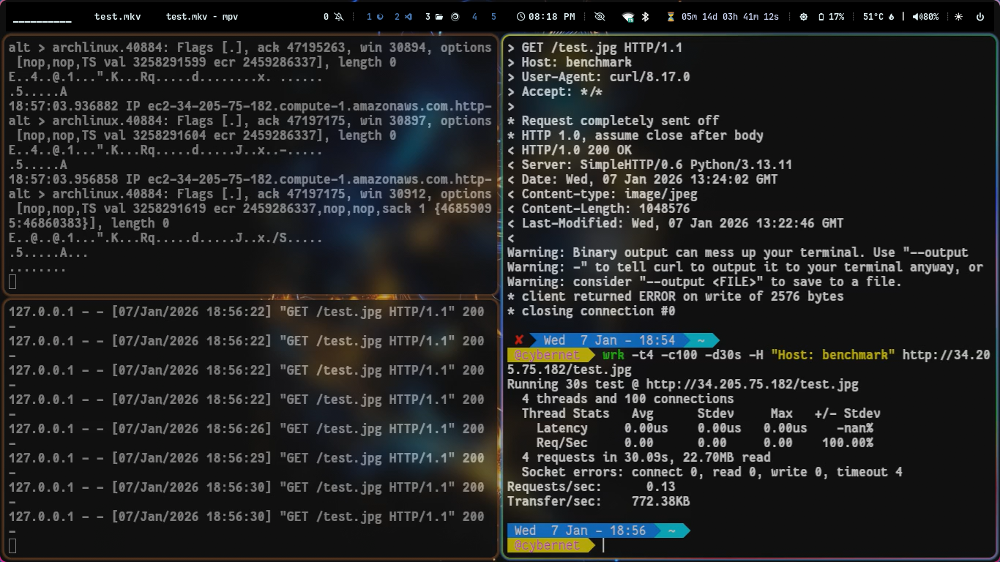
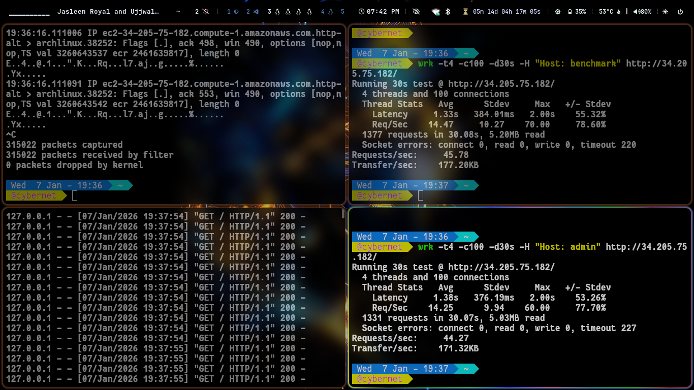

# ForgeTunnel

**ForgeTunnel** is a **high-performance, zero-trust secure tunneling daemon** written in **Go**.

ForgeTunnel allows you to expose a **local server behind NAT or firewall** to the public internet using a **single encrypted TCP connection**. It is a lightweight, protocol-level alternative to tools like **ngrok** or heavy **VPN / reverse-proxy setups**.

---

## 🔑 Key Differentiator

Unlike standard HTTP tunneling, ForgeTunnel uses a **custom binary protocol** secured with:

* **AES-256-GCM encryption**
* **Ed25519 mutual authentication**

This reduces packet overhead by **~95%** compared to HTTP/TLS headers while maintaining strong security.

---

## 🚀 Key Features

* **Zero-Config Connectivity**
  Client initiates the connection. No port forwarding or inbound firewall rules required.

* **Custom Binary Protocol**
  Minimal **5-byte framing header** (1 byte Kind + 4 bytes StreamID).

* **Multiplexed Streams**
  Multiple concurrent HTTP requests over a single persistent TCP connection (0-RTT after handshake).

* **Resilient Design**
  Non-blocking heartbeats and automatic reconnection.

---

## 🔒 Security Architecture

ForgeTunnel is designed for **Zero-Trust internal infrastructure communication**.

| Component    | Implementation     | Purpose                                             |
| ------------ | ------------------ | --------------------------------------------------- |
| Key Exchange | X25519 (ECDH)      | Ephemeral session keys with Perfect Forward Secrecy |
| Identity     | Ed25519 Signatures | Prevents MITM via pinned server identity            |
| Encryption   | AES-256-GCM        | Confidentiality and authenticity                    |
| Integrity    | AES-GCM AAD        | Header bound to payload to prevent tampering        |

---

## 🛠️ Installation & Setup

### Prerequisites

* Go **1.21+**
* Linux / macOS recommended

---

### 1️⃣ Clone the Repository

```bash
git clone https://github.com/yourusername/forgetunnel.git
cd forgetunnel
```

---

### 2️⃣ Generate Identity Keys

ForgeTunnel uses a **Trust-On-First-Use (TOFU)** / key-pinning model similar to SSH.

Create a helper file `gen_keys.go`:

```go
package main

import (
    "crypto/ed25519"
    "crypto/rand"
    "encoding/hex"
    "fmt"
)

func main() {
    pub, priv, _ := ed25519.GenerateKey(rand.Reader)
    fmt.Printf("SERVER_PRIVATE_KEY=%s\n", hex.EncodeToString(priv))
    fmt.Printf("SERVER_PUBLIC_KEY=%s\n", hex.EncodeToString(pub))
}
```

Run:

```bash
go run gen_keys.go
```

---

### 3️⃣ Configure Keys

* **Server**: Paste `SERVER_PRIVATE_KEY` into
  `server/server.go → serverStaticPrivKeyBytes`

* **Client**: Paste `SERVER_PUBLIC_KEY` into
  `client/client.go → serverStaticPubKeyBytes`

---

## 🏃 Usage

### Step 1: Start the Public Server

The server listens on:

* `:8080` → control plane (agents)
* `:80` → public traffic

```bash
sudo go run server/main.go
```

---

### Step 2: Start Your Local Application

Example: expose a service on port `3000`.

```bash
python3 -m http.server 3000
```

---

### Step 3: Start the Client (Agent)

Run on the private machine:

```bash
go run client/main.go
```

---

### Step 4: Access the Tunnel

Open in browser:

```
http://website.localhost
```

For local testing, add:

```bash
127.0.0.1 website.localhost
```

to `/etc/hosts`.

---

## 🧠 Protocol Specification

ForgeTunnel does **not** use HTTP for transport. All data flows over raw TCP frames:

```
[ Length (4 bytes) ]
[ Kind (1 byte) ]
[ StreamID (4 bytes) ]
[ Encrypted Payload (N bytes + GCM Tag) ]
```

* **Kind**: 0=Handshake, 1=Control, 2=Data
* **StreamID**: Multiplexed request/response identifier
* **AAD**: (Kind + StreamID) bound to payload for integrity

---

## 📊 Benchmarks & Performance

### 📸 Benchmark Screenshots

The following terminal screenshots were captured during real benchmark runs and are included for transparency and verification.


####  Terminal layout explanation:

* Left terminal: tcpdump capturing raw TCP packets on the tunnel interface, showing continuous encrypted traffic flow, ACKs, window scaling, and retransmissions.
* Local application server logs (python -m http.server) confirming successful request delivery from the tunnel.
* Right terminal: Benchmark client issuing requests through ForgeTunnel and displaying t Throughput and transfer statistics.


#### Single Client Benchmark

* Single active client
* Large payload transfer
* Shows raw tunnel stability and bandwidth behavior



#### Multi Client Benchmark

* 4 threads
* 100 concurrent connections
* Demonstrates multiplexing and concurrency handling



---

### Network Conditions

| Metric         | Value               |
| -------------- | ------------------- |
| Download       | 34.12 Mbps          |
| Upload         | 3.35 Mbps           |
| Packet Size    | 1 MB                |
| Client Network | Home broadband      |
| Server         | AWS EC2 (us-east-1) |

---

### Test 1: Large Payload (1 MB)

```bash
wrk -t4 -c100 -d30s http://34.205.75.182/test.jpg
```

**Results**

* Requests/sec: **2.66**
* Transfer/sec: **4.15 MB**
* Total Data: **124.76 MB**
* Timeouts: **80** (bandwidth saturation)

**Observation**

* Throughput limited by upload bandwidth
* Stable encrypted transfer
* No protocol-level errors

---

### Test 2: Small Packets / Control Traffic

```bash
wrk -t4 -c100 -d30s -H "Host: benchmark" http://34.205.75.182
```

**Results**

* Requests/sec: **83.99**
* Transfer/sec: **321.7 KB**
* Avg Latency: **~830 ms**
* Timeouts: **67**

**Observation**

* Efficient multiplexing over single TCP connection
* Suitable for APIs and control-plane traffic
* Latency influenced by geography and upload limits

---

## 🔁 Comparison with Common Alternatives

ForgeTunnel is often compared with **Reverse Proxies** and **VPNs**. Below is a practical comparison showing where ForgeTunnel fits best.

### ForgeTunnel vs Reverse Proxy (Nginx / Traefik / Cloudflare Tunnel)

| Aspect           | Reverse Proxy             | ForgeTunnel                |
| ---------------- | ------------------------- | -------------------------- |
| Protocol         | HTTP / HTTPS              | Custom binary TCP protocol |
| Setup Complexity | Medium–High               | Low (agent-based)          |
| NAT Traversal    | Requires port forwarding  | No inbound ports needed    |
| Overhead         | High (HTTP + TLS headers) | Very low (5-byte framing)  |
| Multiplexing     | HTTP/2 or HTTP/3          | Native stream multiplexing |
| Security Model   | TLS certificates          | Zero-trust key pinning     |
| Best Use         | Public web traffic        | Internal services & APIs   |

**Summary**
Reverse proxies work best for public-facing websites. ForgeTunnel is better for **private services**, **internal APIs**, and **low-overhead tunnels**.

---

### ForgeTunnel vs VPN (WireGuard / OpenVPN)

| Aspect         | VPN                 | ForgeTunnel               |
| -------------- | ------------------- | ------------------------- |
| Network Access | Full subnet access  | Single service access     |
| Privileges     | Root/admin required | User-level process        |
| Attack Surface | Large               | Minimal                   |
| Configuration  | Complex             | Simple static key pinning |
| Scope          | System-wide         | Per application           |
| Zero Trust     | Weak by default     | Strong by design          |

**Summary**
VPNs are powerful but heavy. ForgeTunnel applies **least privilege**, exposing only what is needed without granting full network access.

---

### When to Use ForgeTunnel

Use ForgeTunnel when:

* You cannot open inbound firewall ports
* You need zero-trust, identity-based access
* You want minimal protocol overhead
* You want VPN-like tunneling without root access

---

## 📌 Key Takeaways

* Minimal protocol overhead compared to HTTP/TLS
* Bandwidth-bound, not CPU-bound
* Stable under high concurrency
* Designed for secure internal service exposure

---

## ⚠️ Disclaimer

This project is a **proof-of-concept** for secure network programming and cryptography.

While it uses industry-standard primitives (AES-GCM, Ed25519, X25519), rolling your own protocol is generally **not recommended for production**. Prefer TLS 1.3 for enterprise use unless risks are fully understood.

---

## 📎 Use Cases

* Internal service exposure
* Secure agent-to-server communication
* Lightweight VPN alternative
* Learning low-level networking in Go
